# 🚀 Cliqs — Premium Flutter Todo App

Cliqs is a **modern, elegant, and high-performance task management application** built with **Flutter**.
It demonstrates **production-ready architecture, clean code principles, and modern UI/UX patterns** used in professional mobile development.

The application focuses on **simplicity, productivity, and visual elegance**, enabling users to efficiently manage daily tasks with a smooth experience.

---

# 📱 App Screenshots

## Authentication

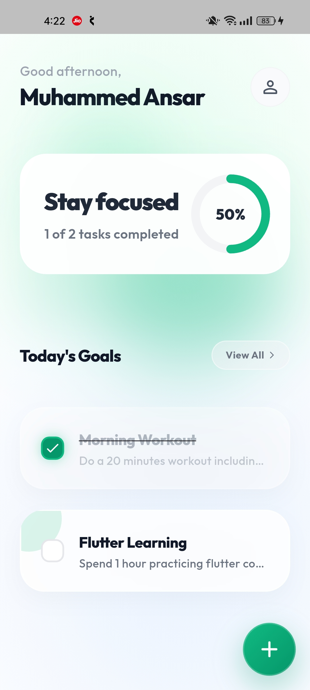 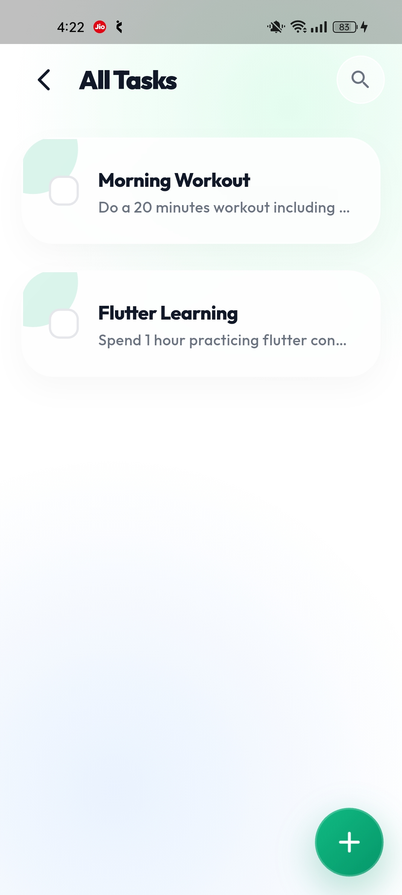 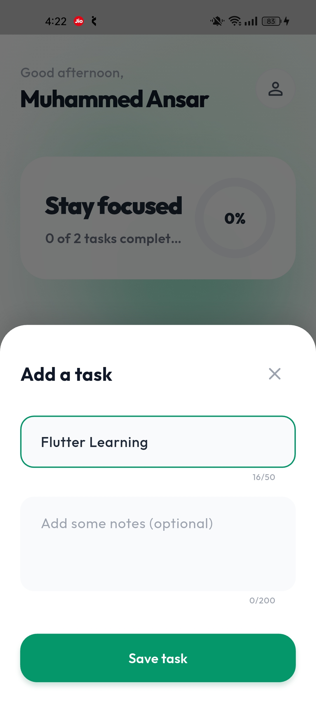

* Secure **Sign Up**
* **Login authentication**
* **Password recovery system**

---

## Home Dashboard

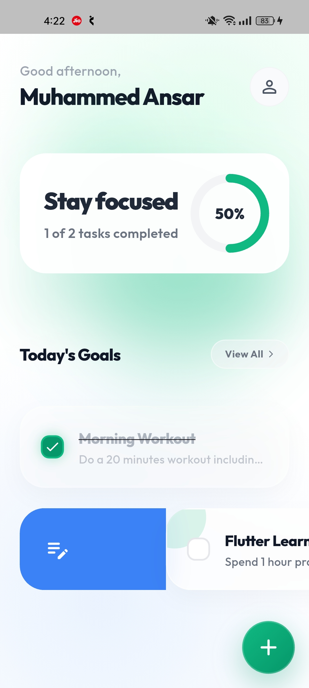 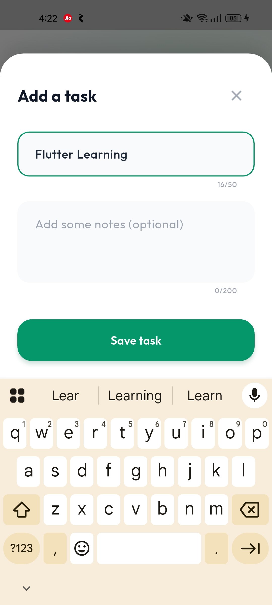 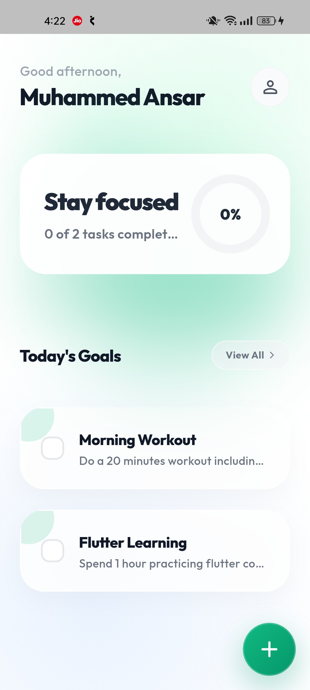

Features include:

* Personalized greeting dashboard
* Dynamic **task progress indicator**
* Smooth animated task cards
* Today's goals section

---

## Task Management

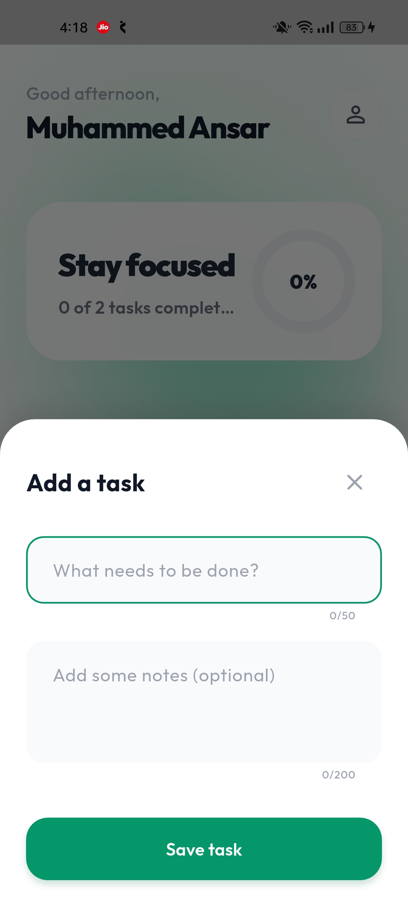 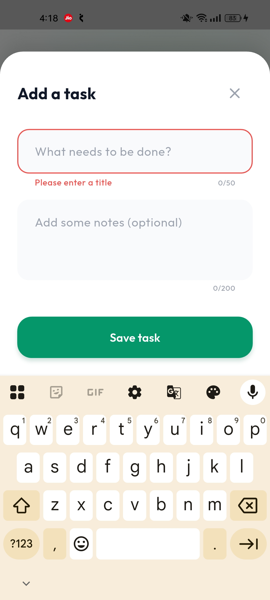 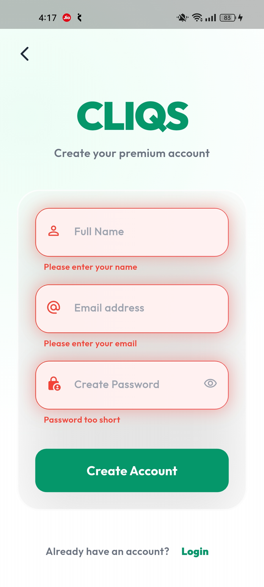

Users can:

* Create tasks
* Add optional notes
* View all tasks
* Track completion progress

---

## Interactive Gestures

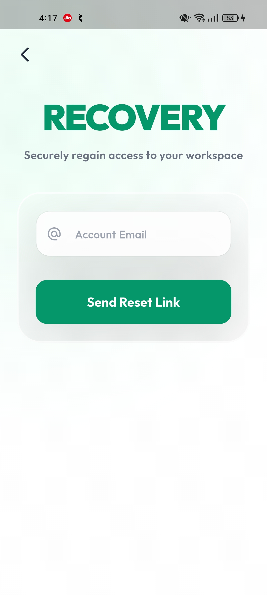 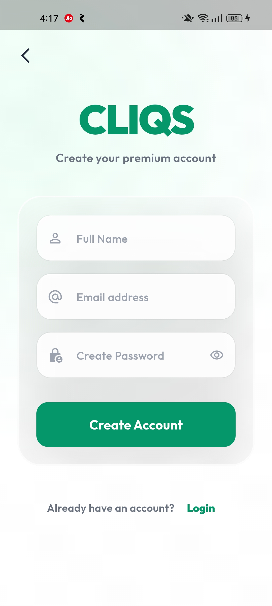 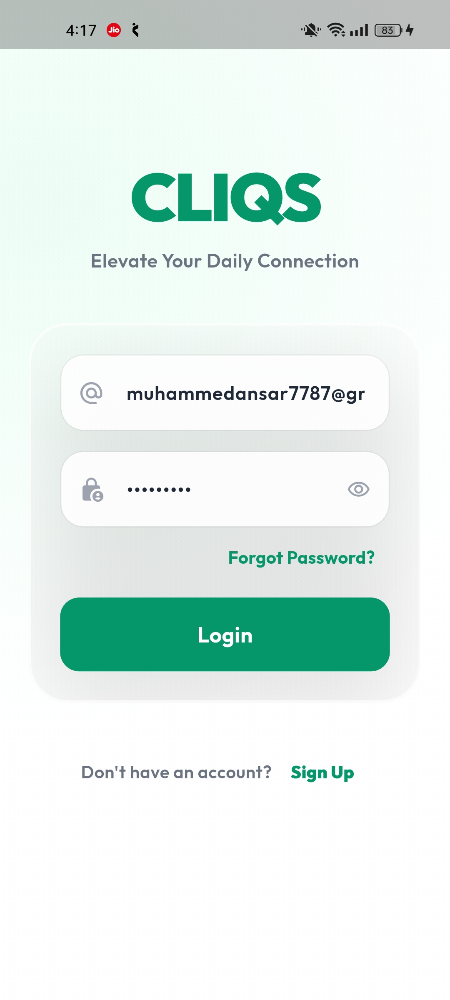

* Swipe to delete tasks
* Smooth animations
* Responsive UI interactions

---

# 🧠 Architecture

Cliqs follows a **Feature-First Clean Architecture**, making the codebase **scalable, maintainable, and testable**.

```
lib
│
├── core
│   ├── error
│   ├── network
│   └── utils
│
├── features
│   ├── auth
│   │   ├── data
│   │   ├── domain
│   │   └── presentation
│   │
│   └── tasks
│       ├── data
│       ├── domain
│       └── presentation
│
└── injection_container.dart
```

### Architecture Layers

**Presentation Layer**

* UI
* BLoC state management

**Domain Layer**

* Entities
* Repository contracts
* Use cases

**Data Layer**

* Firebase data sources
* Repository implementations
* Models

---

# ⚙️ Core Architecture Concepts

### 🧩 BLoC State Management

Unidirectional data flow with clear separation between UI and business logic.

### 📦 Dependency Injection

Implemented using **GetIt** for modular and scalable architecture.

### ❗ Global Failure Handling

Using **Dartz Either** pattern for predictable error handling.

### 🌐 Network Awareness

Using **connectivity_plus** to detect internet availability.

---

# ✨ Features

### 🔐 Authentication

* Firebase Email & Password Login
* Secure Registration
* Password Reset

### 📝 Task Management

* Add tasks
* Add notes
* Mark tasks as completed
* Delete tasks with swipe gesture

### 🎨 Premium UI

* Gradient backgrounds
* Glassmorphism style cards
* Smooth animations
* Shimmer loading effect

### 📊 Task Progress

Dynamic progress indicator showing completed tasks percentage.

---

# 🛠 Tech Stack

| Technology                 | Purpose                     |
| -------------------------- | --------------------------- |
| Flutter                    | Cross-platform UI framework |
| Firebase Auth              | User authentication         |
| Firebase Realtime Database | Task storage                |
| BLoC                       | State management            |
| GetIt                      | Dependency injection        |
| Dartz                      | Functional error handling   |
| Equatable                  | Value equality              |
| Go Router                  | Navigation                  |
| HTTP                       | Network communication       |
| Connectivity Plus          | Internet detection          |
| Shared Preferences         | Local caching               |
| Flutter Animate            | Animations                  |
| Shimmer                    | Skeleton loading            |
| Flutter Slidable           | Swipe gestures              |

---

# 📦 Dependencies

```
firebase_core
firebase_auth
firebase_database
google_sign_in

flutter_bloc
get_it

dartz
equatable
http
connectivity_plus
shared_preferences

flutter_screenutil
shimmer
flutter_animate
google_fonts
go_router
flutter_slidable
```

---

# 🚀 Getting Started

### 1️⃣ Clone the repository

```
git clone https://github.com/ansar7787/cliqs-flutter-app.git
```

### 2️⃣ Install dependencies

```
flutter pub get
```

### 3️⃣ Configure Firebase

Create a Firebase project and enable:

* Authentication (Email/Password)
* Realtime Database

Download

```
google-services.json
```

Place it in

```
android/app/
```

### 4️⃣ Run the app

```
flutter run
```

---

# 📈 Future Improvements

* Push Notifications
* Dark Mode
* Task Categories
* Due Date & Reminders
* Offline Support
* Task Sorting

---

# 👨‍💻 Author

**Muhammed Ansar**

Flutter Developer passionate about building **scalable and beautifully designed mobile applications.**

GitHub
https://github.com/ansar7787

---

# ⭐ Support

If you like this project:

* ⭐ Star the repository
* 🍴 Fork the project
* 💡 Share feedback

---

💚 Built with **Flutter + Clean Architecture**
